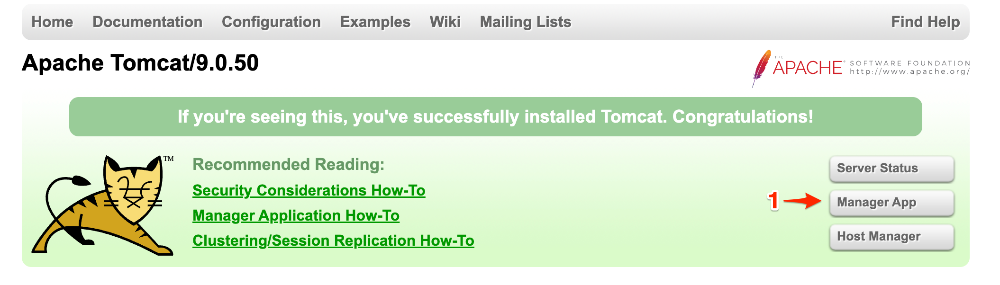
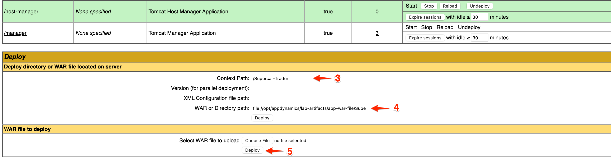
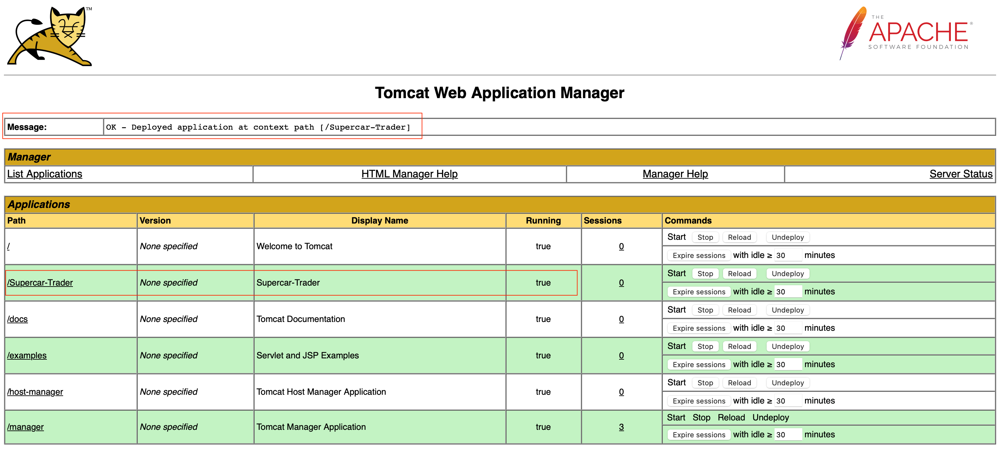

## Install the application on Apache Tomcat

The Apache Tomcat landing page can be accessed through your web browser with a URL in the format like below. Make sure to use the IP address or public domain name of your ec2 instance

```bash
http://[ec-ip-address]:8088
```


1. Click Manager App.
2. You will be prompted to enter a username and password. Use following credentials to login to the Tomcat Manager App.

Username: admin  
Password: welcome1  

  


{}
If you are having "401 Unauthorized" issues when clicking on "Manager App", try to use an incognito window or a different browser. If the issues persist even with a different web browser, let your instructor know, it may be a configuration problem.
{}

You should now see the Tomcat Manager App page. Under the **Deploy** section enter the following values:

1. Enter **/Supercar-Trader** in the **Context Path**: field.
2. Enter the following path in the **WAR or Directory path:** field.

```bash
file://opt/appdynamics/lab-artifacts/app-war-file/Supercar-Trader.war
```

5. Click the **Deploy** button.

  
  
Once the deployment is completed, you should see the application running as shown in the following image.

         

The sample application home page is accessible through your web browser with a URL in the format seen below. Enter that URL in your browser’s navigation bar, substituting the IP Address of your EC2 instance. Likewise, you can click on the application path **/Supercar-Trader** outlined in the previous image. 

```bash
http://[ec2-ip-address]:8080/Supercar-Trader/home.do
``` 

You should be able to see the home page of the Supercar Trader application  
 


## Start the Load Generation

SSH into your ec2 instance and execute the following commands:

```bash
sudo chmod 754 /opt/appdynamics/lab-artifacts/phantomjs/*.sh
sed -i -e 's/\r$//' /opt/appdynamics/lab-artifacts/phantomjs/*.sh

# Change it to use port 8088
sed -i -e 's/8080/8088/g' /opt/appdynamics/lab-artifacts/phantomjs/*.js
```

Start the loadgen, it may take a few minutes for all the scripts to run. 

``` bash
cd /opt/appdynamics/lab-artifacts/phantomjs
./start_load.sh
```

## Confirm transaction load in the Controller

Use your web browser to access the AppDynamics Controller. Login to the Controller and you should see the Supercar-Trader-YOURINITIALS application.

1. From the Overview page (Landing Page). Click on the **Applications** tab on the left navigation panel
2. Within the **Applications** page you can manually search for your application or you can use the search bar in the top right corner to narrow down your search. 

  

   

Click in your application's name, this should bring you into the **Application Flow Map**, you should see all the application components appear after twelve minutes.

If you don’t see all the application components after twelve minutes, try waiting a few more minutes and refresh your browser tab.
 
  


During the agent download step we assigned the Tier name and Node name for the Tomcat server.

``` bash
<tier-name>Web-Portal</tier-name>
<node-name>Web-Portal_Node-01</node-name>
```

You might be wondering how the other four services had their Tier and Node name assigned. The sample application dynamically creates four additional JVMs from the initial Tomcat JVM and assigns the Tier and Node names by passing those properties into the JVM startup command as -D properties for each of the four services. Any -D properties included on the JVM startup command line will supersede the properties defined in the Java agents controller-info.xml file.

To see the JVM startup parameters used for each of the four services that were dynamically started, issue the following command in your terminal window of your ec2 instance.  
  

{}
``` bash
ps -ef | grep appdynamics.agent.tierName
``` 
{}
{}
``` bash
splunk     47131   46757  3 15:34 pts/1    00:08:17 /usr/lib/jvm/java-8-openjdk-amd64/jre/bin/java -javaagent:/opt/appdynamics/javaagent/javaagent.jar -Dappdynamics.controller.hostName=se-lab.saas.appdynamics.com -Dappdynamics.controller.port=443 -Dappdynamics.controller.ssl.enabled=true -Dappdynamics.agent.applicationName=Supercar-Trader-AppD-Workshop -Dappdynamics.agent.tierName=Api-Services -Dappdynamics.agent.nodeName=Api-Services_Node-01 -Dappdynamics.agent.accountName=se-lab -Dappdynamics.agent.accountAccessKey=hj6a4d7h2cuq -Xms64m -Xmx512m -XX:MaxPermSize=256m supercars.services.api.ApiService
splunk     47133   46757  2 15:34 pts/1    00:08:11 /usr/lib/jvm/java-8-openjdk-amd64/jre/bin/java -javaagent:/opt/appdynamics/javaagent/javaagent.jar -Dappdynamics.controller.hostName=se-lab.saas.appdynamics.com -Dappdynamics.controller.port=443 -Dappdynamics.controller.ssl.enabled=true -Dappdynamics.agent.applicationName=Supercar-Trader-AppD-Workshop -Dappdynamics.agent.tierName=Inventory-Services -Dappdynamics.agent.nodeName=Inventory-Services_Node-01 -Dappdynamics.agent.accountName=se-lab -Dappdynamics.agent.accountAccessKey=hj6a4d7h2cuq -Xms64m -Xmx512m -XX:MaxPermSize=256m supercars.services.inventory.InventoryService
splunk     47151   46757  1 15:34 pts/1    00:04:58 /usr/lib/jvm/java-8-openjdk-amd64/jre/bin/java -javaagent:/opt/appdynamics/javaagent/javaagent.jar -Dappdynamics.controller.hostName=se-lab.saas.appdynamics.com -Dappdynamics.controller.port=443 -Dappdynamics.controller.ssl.enabled=true -Dappdynamics.agent.applicationName=Supercar-Trader-AppD-Workshop -Dappdynamics.agent.tierName=Insurance-Services -Dappdynamics.agent.nodeName=Insurance-Services_Node-01 -Dappdynamics.agent.accountName=se-lab -Dappdynamics.agent.accountAccessKey=hj6a4d7h2cuq -Xms64m -Xmx68m -XX:MaxPermSize=256m supercars.services.insurance.InsuranceService
splunk     47153   46757  3 15:34 pts/1    00:08:17 /usr/lib/jvm/java-8-openjdk-amd64/jre/bin/java -javaagent:/opt/appdynamics/javaagent/javaagent.jar -Dappdynamics.controller.hostName=se-lab.saas.appdynamics.com -Dappdynamics.controller.port=443 -Dappdynamics.controller.ssl.enabled=true -Dappdynamics.agent.applicationName=Supercar-Trader-AppD-Workshop -Dappdynamics.agent.tierName=Enquiry-Services -Dappdynamics.agent.nodeName=Enquiry-Services_Node-01 -Dappdynamics.agent.accountName=se-lab -Dappdynamics.agent.accountAccessKey=hj6a4d7h2cuq -Xms64m -Xmx512m -XX:MaxPermSize=256m supercars.services.enquiry.EnquiryService
splunk    144789   46722  0 20:09 pts/1    00:00:00 grep --color=auto appdynamics.agent.tierName
```
{}

  
Once all of the components appear on the flow map, you should see an HTTP cloud icon that represents the three HTTP backends called by the Insurance-Services Tier.

Ungroup the the three HTTP backends by following these steps.
1. Right click the HTTP cloud icon labeled 3 HTTP backends
2. From the drop down menu, select Ungroup Backends

   
  
Once the HTTP backends have been ungrouped, you should see all three HTTP backends as shown in the following image.  

 