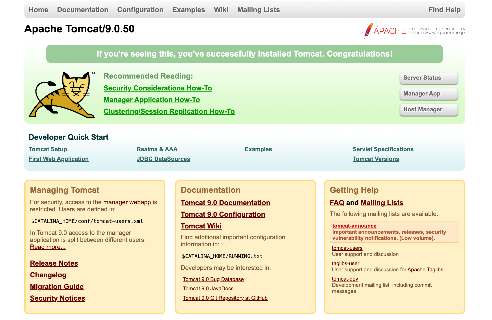
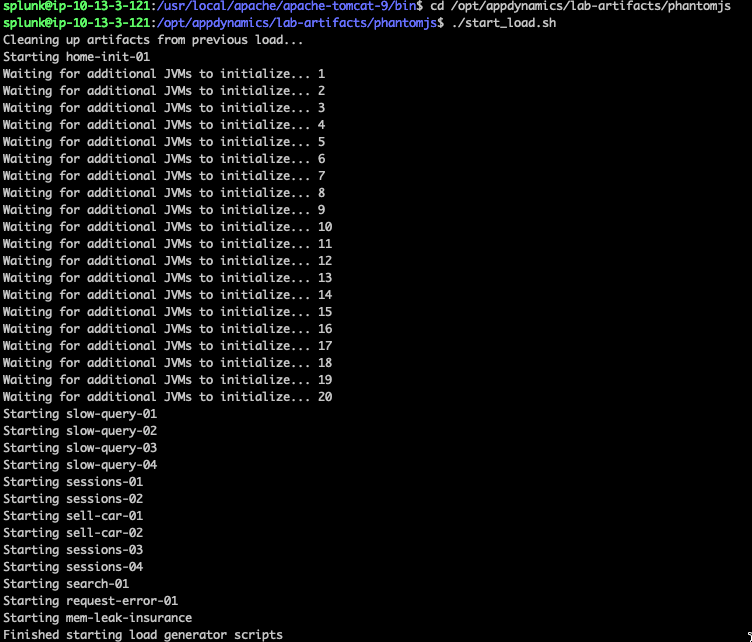

## Install the application on Apache Tomcat

The Apache Tomcat landing page can be accessed through your web browser with a URL in the format like below. Make sure to use the IP address or public domain name of your ec2 instance

```bash
http://[ec-ip-address]:8088
```



1. Click Manager App.
2. You will be prompted to enter a username and password. Use following the case sensitive credentials to login to the Tomcat Manager App.

Username: admin
Password: welcome1


{}
If you are having "401 Unauthorized" issues when clicking on "Manager App", try to use an incognito window or a different browser. If the issues persist even with a different web browser, let your instructor know, it may be a misconfiguration problem.
{}

You should now see the Tomcat Manager App page. Under the **Deploy** section enter the following values:

3. Enter /Supercar-Trader in the **Context Path**: field.
4. Enter the following path in the **WAR or Directory path:** field.

```bash
file://opt/appdynamics/lab-artifacts/app-war-file/Supercar-Trader.war
```

5. Click the **Deploy** button.


Once the deployment is completed, you should see the application running as shown in the following image.


The sample application home page is accessible through your web browser with a URL in the format seen below. Enter that URL in your browser’s navigation bar, substituting the IP Address of your EC2 instance. Likewise, you can click on the application path **/Supercar-Trader** outlined in the previous image. 

```bash
http://[ec2-ip-address]:8080/Supercar-Trader/home.do
``` 

You should be able to see the home page of the Supercar Trader application 


## Start the Load Generation

SSH into your ec2 instance and execute the following commands:

```bash
sudo chmod 754 /opt/appdynamics/lab-artifacts/phantomjs/*.sh
sed -i -e 's/\r$//' /opt/appdynamics/lab-artifacts/phantomjs/*.sh

# Change it to use port 8088
sed -i -e 's/8080/8088/g' /opt/appdynamics/lab-artifacts/phantomjs/*.js
```

Start the loadgen, it may take a few minutes before its fully running. 


{}
``` bash
cd /opt/appdynamics/lab-artifacts/phantomjs
./start_load.sh
```
{}
{}
 
{}



## Confirm transaction load in the Controller
