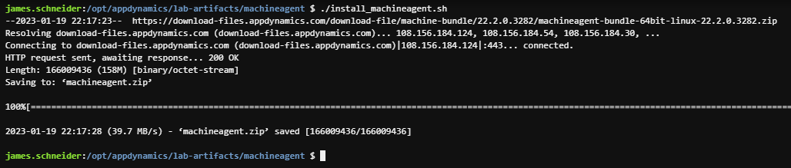
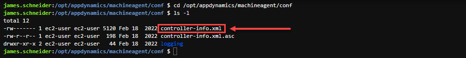

In this exercise you will perform the following actions:

1. Run a script that will install the Server Visibility agent
2. Configure the Server Visibility agent
3. Start the Server Visibility agent

## Navigate to the Install Script

Use the command below to change to the directrory where the script is located.

```bash
cd /opt/appdynamics/lab-artifacts/machineagent/
```

## Run the Install Script

Use the command below to run the install script.

```bash
./install_machineagent.sh
```

You should see output similar to the following image.



## Configure the Server Agent

Obtain the configuration property values listed below from the Java Agents “controller-info.xml” file as described in the Java Agent Configuration File section and have them available for the next step.

- controller-host
- controller-port
- controller-ssl-enabled
- account-name
- account-access-key

Now you will need to navigate to the “controller-info.xml” file of the Server Agent by using the commands below.

```bash
cd /opt/appdynamics/machineagent/conf
ls -l
```

You should see output similar to the following image.



Edit the “controller-info.xml” file of the Server Agent and insert the values for the properties you obtained from the Java Agent configuration file, listed below.

- controller-host
- controller-port
- controller-ssl-enabled
- account-name
- account-access-key

You will need to set the “sim-enabled” property to true and then save the file which should look similar to the image below.

[Example Config](images/svm-config-02.png)

## Start the Server Visibility agent

Use the following commands to start the Server Visibility agent and verify that it started.

```bash
cd /opt/appdynamics/machineagent/bin
nohup ./machine-agent &
ps -ef | grep machine
```

You should see output similar to the following image.


