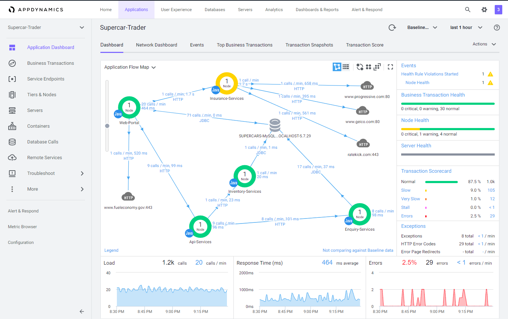
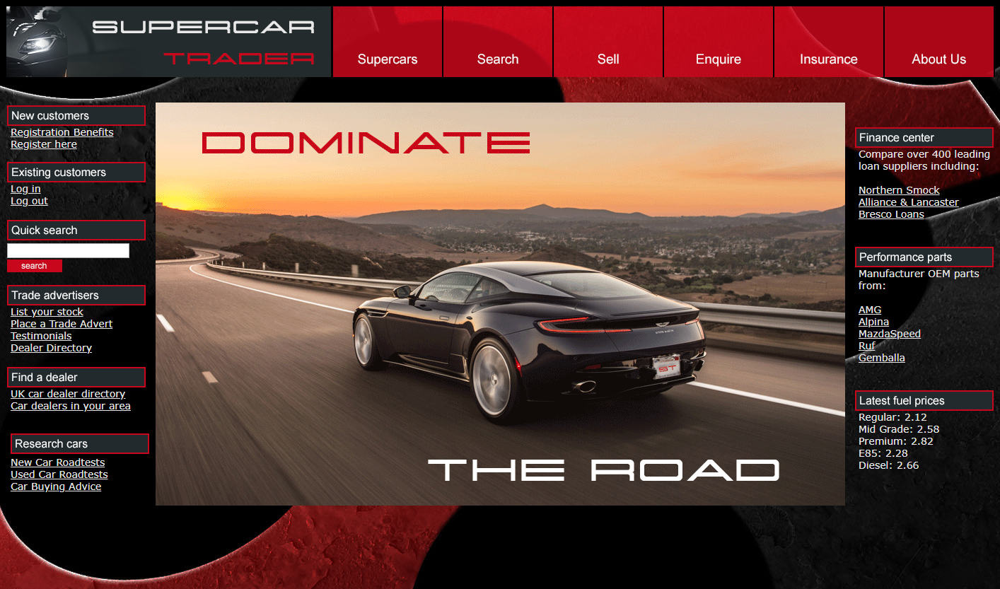

## Objectives 
In this Lab you learn about AppDynamics Server Visibility Monitoring and Service Availability Monitoring.

When you have completed this lab, you will be able to:

- Download the AppDynamics Server Visibility Agent.
- Install the AppDynamics Server Visibility Agent.
- Monitor server health.
- Understand the agent’s extended hardware metrics.
- Quickly see underlying infrastructure issues impacting your application performance.

## Workshop Environment
The lab environment has two hosts:

- The first host is where you installed the AppDynamics Platform and runs the AppDynamics Controller and will be referred to from this point on as the Controller VM.
- The second host runs the Supercar Trader application used in the labs. It will be the host where you will install the AppDynamics agents and will be referred to from this point on as the Application VM.

## Controller
You will be using the AppDynamics SE Lab Controller for this workshop. 
[AppDynamics SE Lab](https://se-lab.saas.appdynamics.com/controller/)

## Application VM
Supercar Trader is a Java-based Web Application

The purpose of Supercar-Trader collection is to generate dynamic traffic (business transactions) for AppDynamics Controller.

