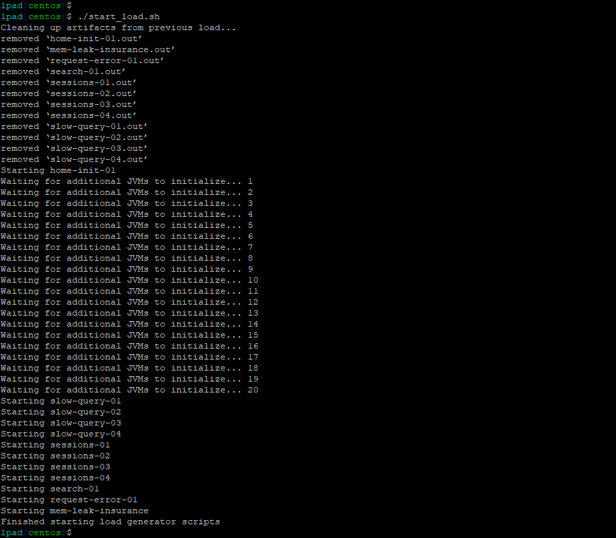

In this exercise you will complete the following tasks:

*   Access your AppDynamics Controller from your web browser.
*   Verify transaction load to the application.
*   Restart the application and transaction load if needed.

## Login to your controller

Use the URL below to login to your controller from your web browser.


{}

``` bash
http://[controller-vm-ip-address]:8090
```

{}

    


## Verify transaction load to the application

Check the application flow map:

**1.** Select the **last 1 hour** time frame.

**2.** Verify you see the five different Tiers on the flow map.

**3.** Verify there has been consistent load over the last 1 hour.


Check the list of business transactions:

**1.** Click the **Business Transactions** option on the left menu.

**2.** Verify you see the eleven business transactions seen below.

**3.** Verify that they have some number of calls during the last hour.

**Note:** If you don’t see the **Calls** column, you can click the **View Options** toolbar button to show that column.


Check the agent status for the Nodes:

**1.** Click the **Tiers & Nodes** option on the left menu.

**2.** Click **Grid View**.

**3.** Verify that the **App Agent Status** for each Node is greater than 90% during the last hour.


  

## Restart the application and transaction load if needed

If any of the checks you performed in the previous steps could not be verified, SSH into your **Application VM** and follow these steps to restart the application and transaction load.

Use the following commands to stop the running instance of Apache Tomcat.

{}

``` bash
cd /usr/local/apache/apache-tomcat-9/bin
./shutdown.sh
```

{}


Use the command below to check for remaining application JVMs still running.


{}

``` bash
ps -ef | grep Supercar-Trader
```

{}


If you find any remaining application JVMs still running, kill the remaining JVMs using the command below.


{}

``` bash
sudo pkill -f Supercar-Trader
```

{}


Use the following commands to stop the load generation for the application.


{}

``` bash
cd /opt/appdynamics/lab-artifacts/phantomjs
./stop_load.sh
```

{}


You should see output similar to the following image.


Now use the following commands to start Apache Tomcat.


{}

``` bash
cd /usr/local/apache/apache-tomcat-9/bin
./startup.sh
```

{}


Wait for two minutes and use the following command to ensure Apache Tomcat is running on port 8080.


{}

``` bash
sudo netstat -tulpn | grep LISTEN
```

{}


You should see output similar to the following image showing that port 8080 is in use by Apache Tomcat.


Use the following commands to start the load generation for the application.


{}

``` bash
cd /opt/appdynamics/lab-artifacts/phantomjs
./start_load.sh
```

{}


You should see output similar to the following image.



  

Next
----

We’ll download the Server Visibility Agent from the Controller.