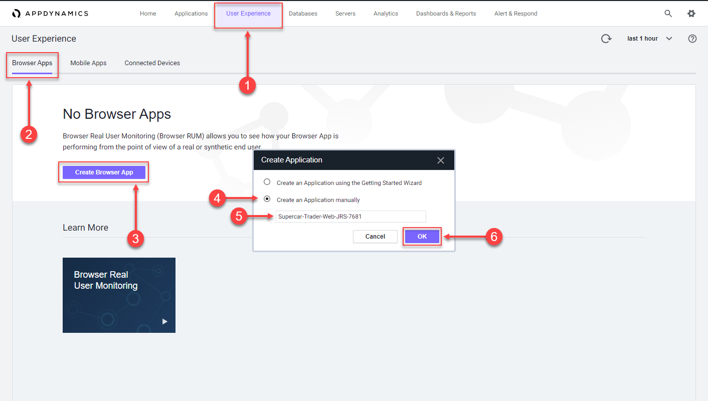
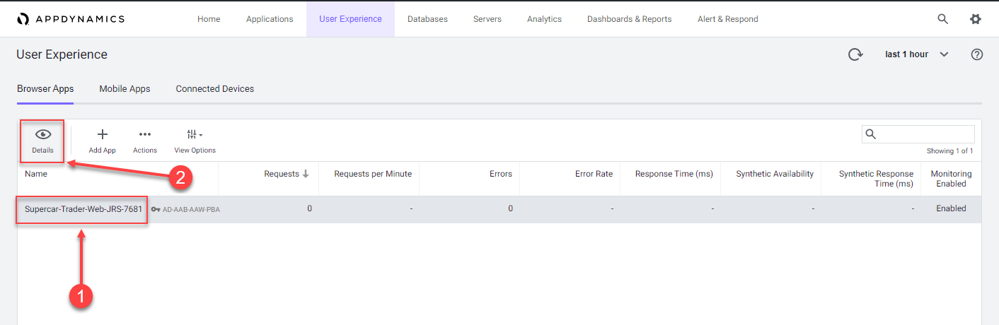
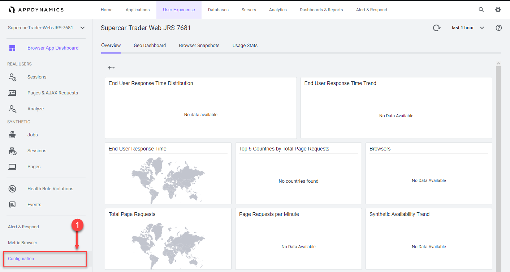
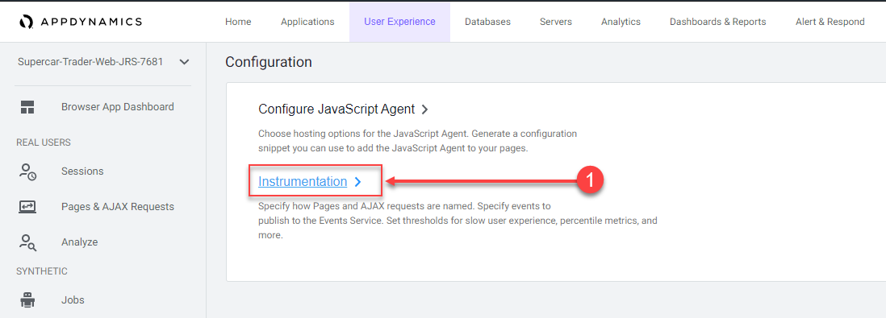
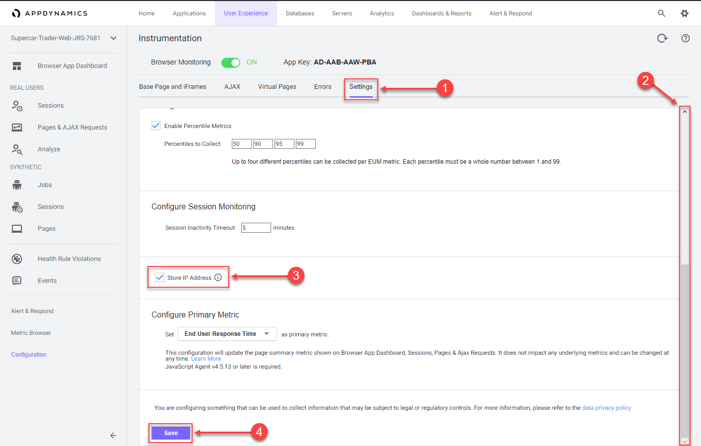

In this exercise you will complete the following tasks:

*   Access your AppDynamics Controller from your web browser.
*   Create the Browser Application in the Controller.
*   Configure the Browser Application.

## Login to your controller

Use the URL below to login to your controller from your web browser.

``` bash
http://[controller-vm-ip-address]:8090
```


## Create the Browser Application in the Controller

Use the following steps to create your new browser application.

**Note**: This lab uses a trial license from AppDynamics which has a constraint with the name of the browser application. It is **very important** that you create a unique name for your browser application in Step 5 below.

**1.** Click the **User Experience** tab on the top menu.

**2.** Click the **Browser Apps** option under **User Experience**.

**3.** Click **Create Browser App**.

**4.** Choose the option **Create an Application manually**.

**5.** Type in a unique name for your browser application in the format _Supercar-Trader-Web-<your\_initials\_or\_name>-<four\_random\_numbers>_

*   Example 1: Supercar-Trader-Web-JFK-3179
*   Example 2: Supercar-Trader-Web-JohnSmith-0953  
    

**6.** Click **OK**.



Use the steps below if you were not automatically taken to the **Browser App Dashboard** for the **Supercar-Trader-Web** application.

**1.** Select **Supercar-Trader-Web-###-####** application in the list.

**2.** Click **Details**.



You should now see the **Browser App Dashboard** for the **Supercar-Trader-Web** application.

**1.** Click the **Configuration** tab on the left menu.



You should now see two main options for configuration, **Configure JavaScript Agent** and **Instrumentation**.

**1.** Click the **Instrumentation** option.



Change the default configuration to have the IP Address stored along with the data captured by the browser monitoring agent by following these steps.

**1.** Click the **Settings** option.

**2.** Use the scroll bar on the right to scroll to the bottom of the screen.

**3.** Check the **Store IP Address** check box.

**4.** Click **Save**.

You can read more about configuring the Controller UI for Browser RUM [**here**](https://help.splunk.com/en/appdynamics-saas/end-user-monitoring/25.7.0/end-user-monitoring/browser-monitoring/browser-real-user-monitoring/overview-of-the-controller-ui-for-browser-rum/configure-the-controller-ui-for-browser-rum).


