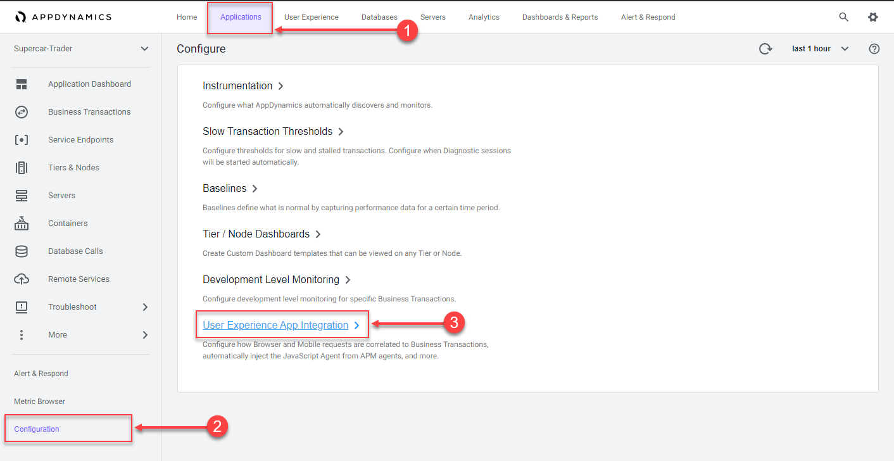
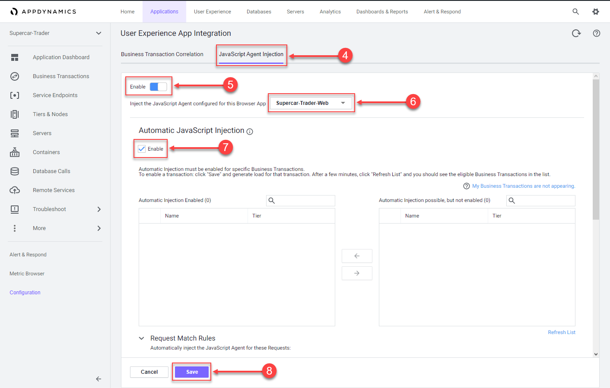
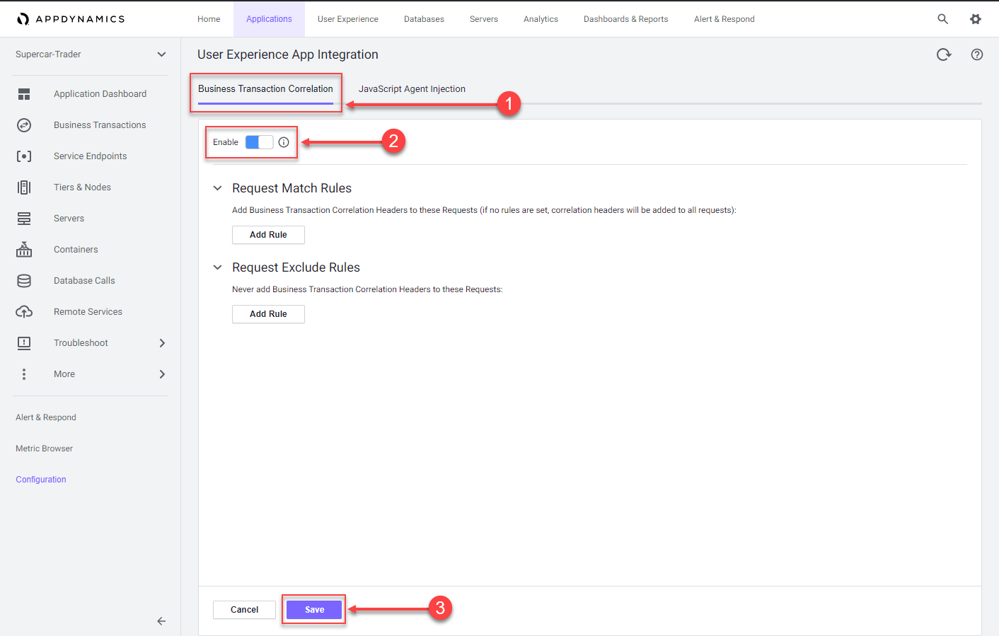
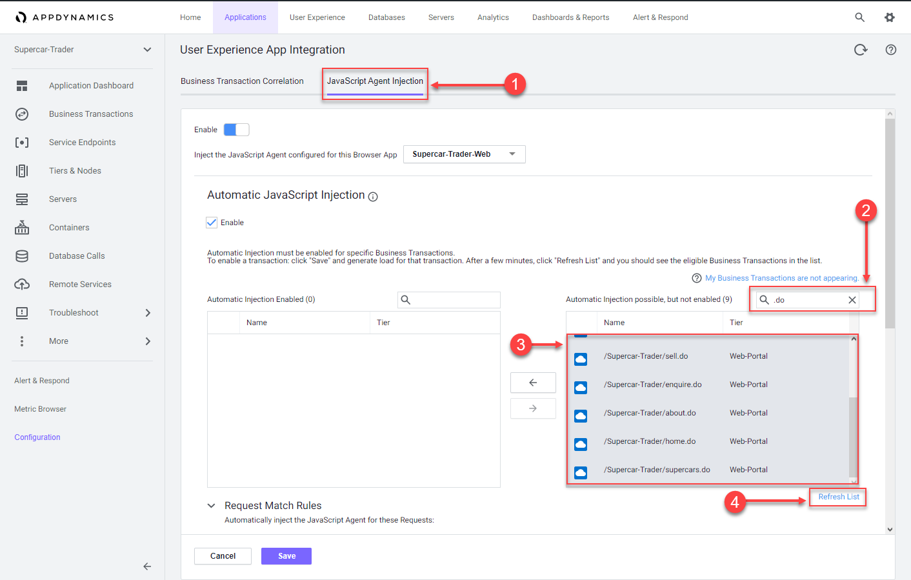
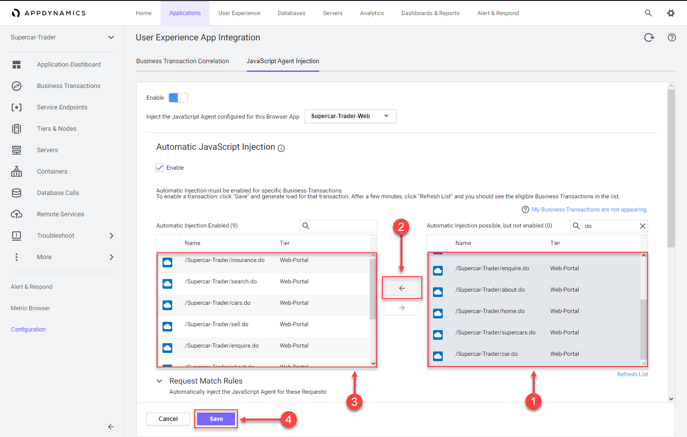

In this exercise you will complete the following tasks:

*   Enable JavaScript Agent injection.
*   Select Business Transactions for injection.

## Enable JavaScript Agent injection

While AppDynamics supports various methods for injecting the JavaScript Agent, you will be using the Auto-Injection method in this lab. Follow these steps to enable the Auto-Injection of the JavaScipt Agent.

**1.** Click the **Applications** tab on the top menu and drill into the Supercar-Trader application.

**2.** Click the **Configuration** tab on the left menu at the bottom.

**3.** Click the **User Experience App Integration** option.

**4.** Click the **JavaScript Agent Injection** tab.

**5.** Click **Enable** so that it turns blue.

**6.** Ensure that **Supercar-Trader-Web** is the selected browser app.

**7.** Check the **Enable** check box under **Enable JavaScript Injection**

**8.** Click **Save**.

It takes a few minutes for the Auto-Injection to discover potential Business Transactions. While this is happening, use these steps to enable the Business Transaction Correlation.

**1.** Click the **Business Transaction Correlation** tab.

**2.** Click the **Enable** button so that it turns blue.

**3.** Click **Save**.

## Select Business Transactions for injection

Use the following steps to select the Business Transactions for Auto-Injection.

**1.** Click the **JavaScript Agent Injection** tab.

**2.** Type **.do** in the search box.

**3.** Ensure there are nine Business Transactions in the list box on the left.

**4.** If all nine Business Transactions do not appear in the list, click the **Refresh List** link until all nine appear.

Use the following steps to move the Business Transactions for Auto-Injection.

**1.** Select all nine Business Transactions from the right list box.

**2.** Click the arrow button to move them to the left list box.

**3.** Ensure there are nine Business Transactions in the left list box.

**4.** Click **Save**.

You can read more about configuring Automatic Injection of the JavaScript Agent [**here**](https://help.splunk.com/en/appdynamics-saas/end-user-monitoring/25.7.0/end-user-monitoring/browser-monitoring/browser-real-user-monitoring/inject-the-javascript-agent/automatic-injection-of-the-javascript-agent).

