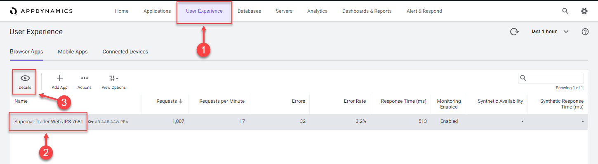
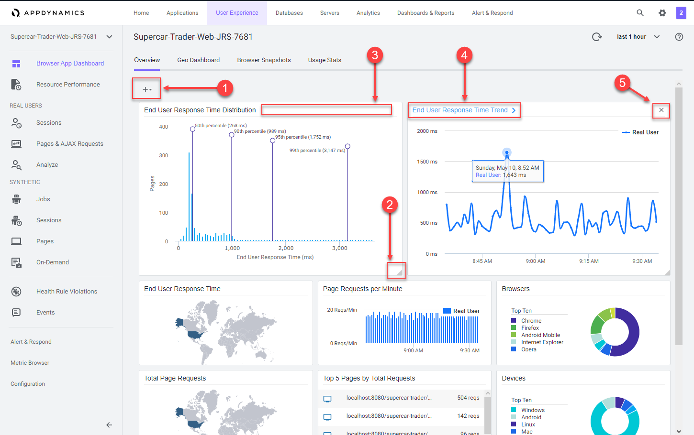
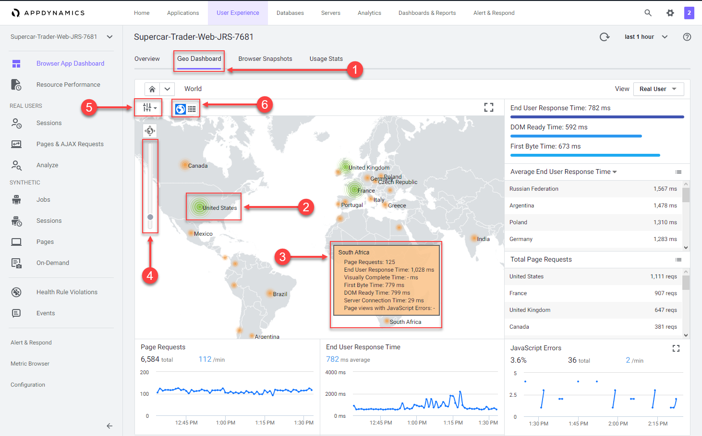
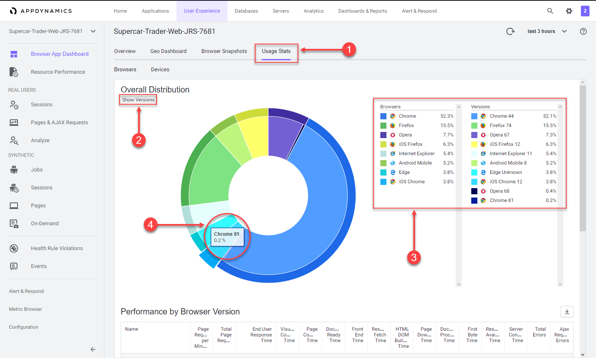
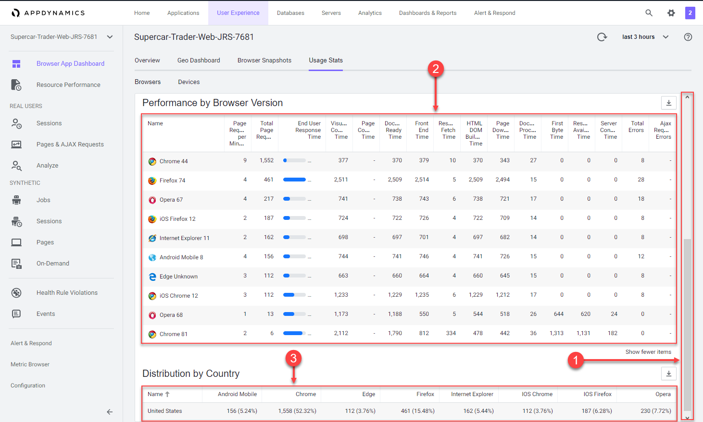
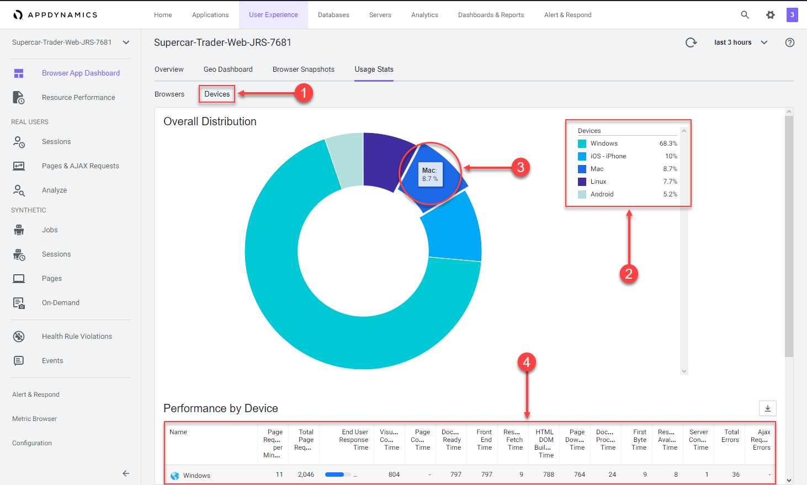

In this exercise you will complete the following tasks:

*   Review the Browser Application Overview Dashboard
*   Review the Browser Application Geo Dashboard
*   Review the Browser Application Usage Stats Dashboard
*   Navigate the Supercar-Trader application web pages

## Review the Browser Application Overview Dashboard

Navigate to the User Experience dashboard and drill into the browser application overview dashboard by following these steps.

**1.** Click the **User Experience** tab on the top menu.

**2.** Click the Supercar-Trader-Web application.

**3.** Click **Details**.



The Overview dashboard displays a set of configurable widgets. The default widgets contain multiple graphs and lists that feature common high-level indicators of application performance, including:

*   End User Response Time Distribution
*   End User Response Time Trend
*   Total Page Requests by Geo
*   End User Response Time by Geo
*   Top 10 Browsers
*   Top 10 Devices
*   Page Requests per Minute
*   Top 5 Pages by Total Requests
*   Top 5 Countries by Total Page Requests

Explore the features of the dashboard.

**1.** Click **+** to choose additional graphs and widgets to add to the dashboard.

**2.** Click and drag the bottom right corner of any widget to resize it.

**3.** Select the outlined area in any widget to move and place it on the dashboard.

**4.** Click on the title of any widget to drill into the detail dashboard.

**5.** Click **X** in the top right corner of any widget to remove it from the dashboard.

Any changes you make to the dashboard widget layout will automatically be saved.

You can read more about the Browser Application Overview dashboard [**here**](https://help.splunk.com/en/appdynamics-saas/end-user-monitoring/25.7.0/end-user-monitoring/browser-monitoring/browser-app-dashboard/overview).



## Review the Browser Application Geo Dashboard

The Geo Dashboard displays key performance metrics by geographic location based on page loads. The metrics displayed throughout the dashboard are for the region currently selected on the map or in the grid. The Map view displays load circles with labels for countries that are in the key timing metrics given in the right panel. Some countries and regions, however, are only displayed in the grid view.

**Note**: Your Browser Application Geo dashboard in the lab will not be populated with as many countries or regions as are shown in this example.

Navigate to the Browser Application Geo dashboard and explore the features of the dashboard described below.

**1.** Click the **Geo Dashboard** option.

**2.** Click on one of the load circles to drill down to the region.

**3.** Hover over one of the regions to show the region details.

**4.** Use the zoom slider to adjust the zoom level.

**5.** Click **Configuration** to explore the map options.

**6.** Switch between the grid view and map view.

You can read more about the Browser Application Geo dashboard [**here**](https://help.splunk.com/en/appdynamics-saas/end-user-monitoring/25.7.0/end-user-monitoring/browser-monitoring/browser-app-dashboard/geo-tab).



## Review the Browser Application Usage Stats Dashboard

The Browser Application Usage Stats dashboard presents aggregated page-load usage data based on your users browser type and device/platform.

The Browser Application Usage Stats dashboard helps you discover:

*   The slowest browsers in terms of total end-user response time.
*   The slowest browsers to render the response page.
*   The browsers that most of your end users use.
*   The browsers that most of your end users use in a particular country or region.

Navigate to the Browser Application Usage Stats dashboard and explore the features of the dashboard described below.

**1.** Click the **Usage Stats** option.

**2.** Click the **Show Versions** option.

**3.** Look at the different browsers and versions by load.

**4.** Hover over the sections in the pie chart to see the details.



Use these steps to explore more metrics by browser and version.

**1.** Use the scroll bar on the right to scroll to the bottom of the page.

**2.** Explore the available metrics by browser and version.

**3.** Explore the available metrics by country.



Navigate to the Devices dashboard and explore the features of the dashboard described below.

**1.** Click the **Devices** option.

**2.** Look at the load by device break out.

**3.** Hover over the sections in the pie chart to see the details.

**4.** Explore the available performance metrics by device.

You can read more about the Browser Application Usage Stats dashboard [**here**](https://help.splunk.com/en/appdynamics-saas/end-user-monitoring/25.7.0/end-user-monitoring/browser-monitoring/browser-app-dashboard/usage-stats).



## Navigate the Supercar-Trader application web pages

Now that you have the Browser Real User Monitoring agent configured and explored the first series of features, let’s generate some additional load and record your unique browser session by navigating the web pages of the Supercar-Trader application.

Open the main page of the app with your web browser. In the example URL below, substitute the IP Address or fully qualified domain name of your Application VM.

``` bash
http://[application-vm-ip-address]:8090/Supercar-Trader/home.do
```

You should see the home page of the application.


Open the listing of available Ferraris.

**1.** Click on the **Supercars** tab on the top menu.

**2.** Clicking on the Ferrari logo.


You should see the list of Ferraris.


Click on the image of the first Ferrari.

**1.** Click **View Enquiries**.

**2.** Click **Enquire**.


Submit an enquiry for the car.

**1.** Complete the fields on the enquiry form with appropriate data.

**2.** Click **Submit**.


Search for cars and continue browsing the site.

**1.** Click on the **Search** tab on the top menu.

**2.** Type the letter **A** into the search box and click **Search**.

**3.** Click on the remaining tabs to explore the web site.


