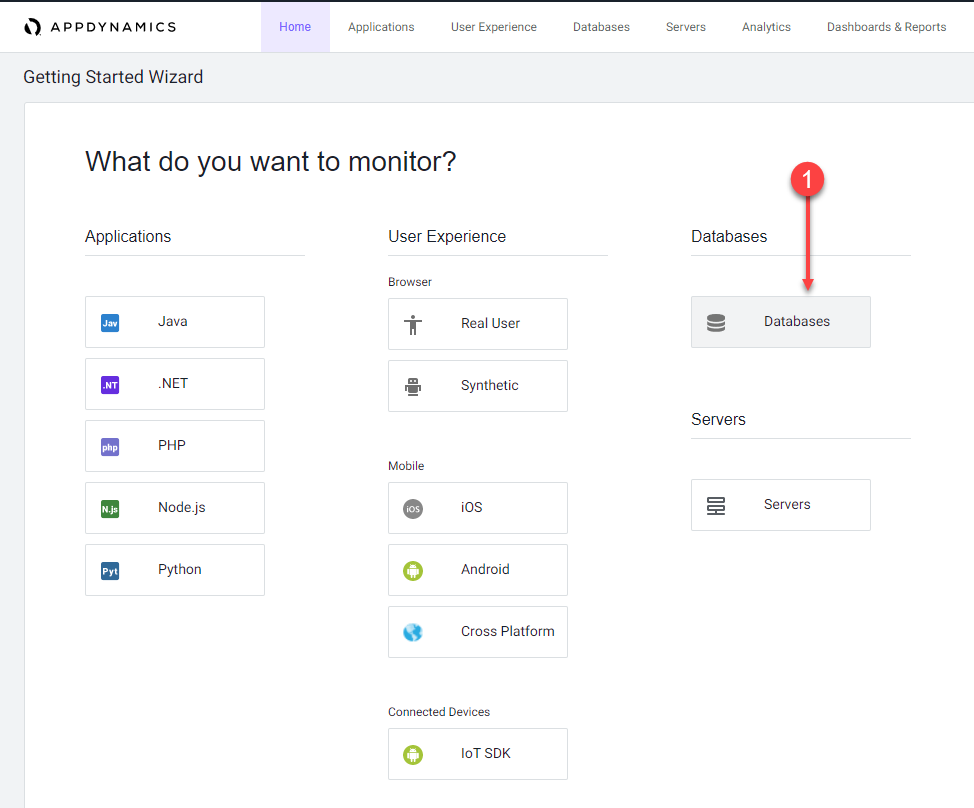
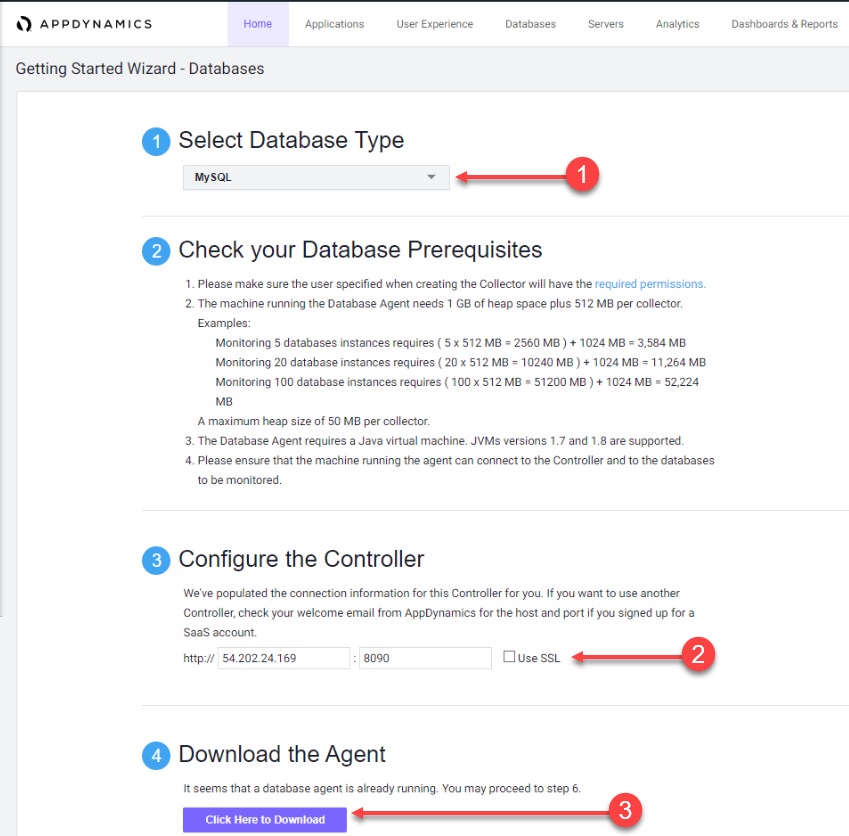
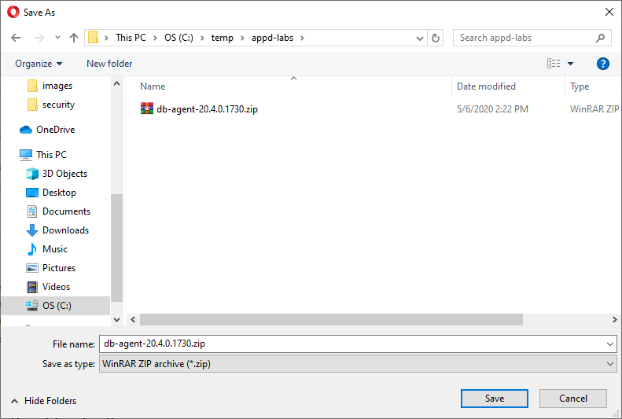

In this exercise you will access your AppDynamics Controller from your web browser and download the Database Visibility agent from there.

## Login to your controller
Use the URL below to login to your controller from your web browser. Use your Cisco single sign on to login.

[Splunk AppDynamics SE Lab](https://se-lab.saas.appdynamics.com/controller/)

## Navigate to the Getting Started Wizard.

1. Select the Home tab at the top left of the screen.
2. Select the Getting Started tab.
3. Click Getting Started Wizard.

## Select the agent for download.

1 . Click Databases.

## Download the Database Agent.

1. Select MySQL from the Select Database Type dropdown menu.
2. Accept the defaults for the Controller connection.
3. Click Click Here to Download.

Save the Database Visibility Agent file to your local file system.

Your browser should prompt you to save the agent file to your local file system, similar to the following image(depending on your OS).

## Next 
We’ll install the Database Visibility Agent.