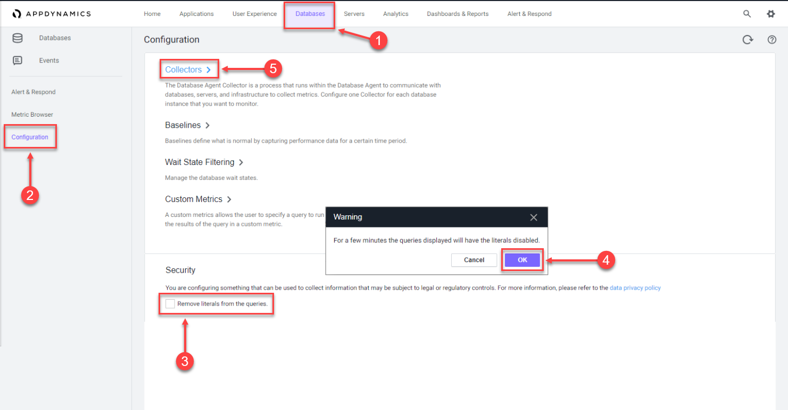
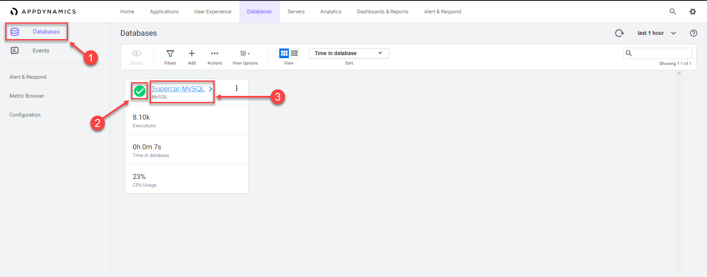
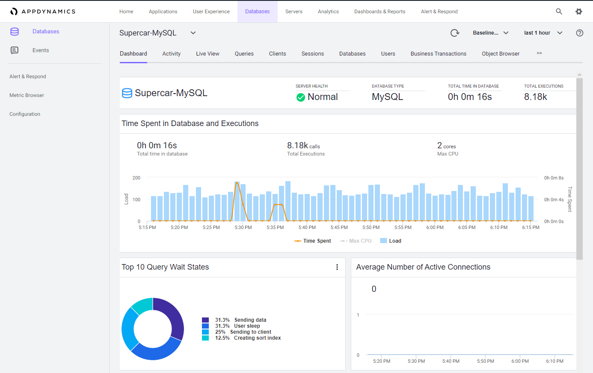
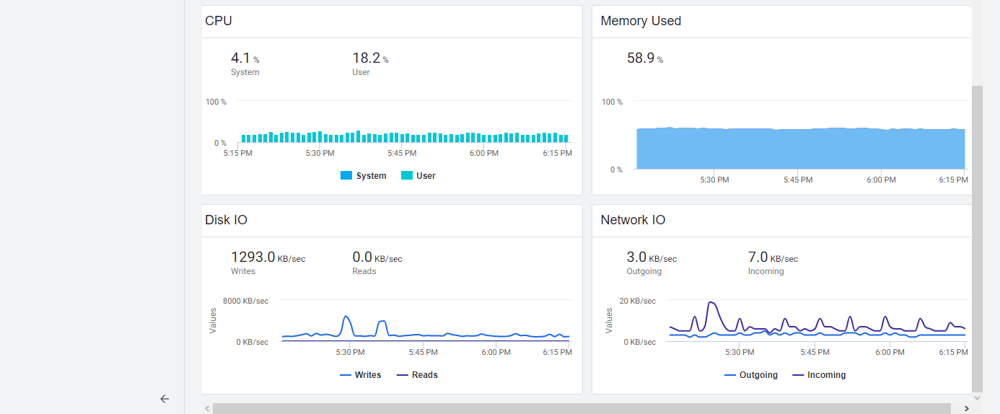

## Configure Database Collector

The Database Agent Collector is the process that runs within the Database Agent to collect performance metrics about your database instances and database servers. One collector collects metrics for one database instance. Multiple collectors can run in one Database Agent. Once the Database Agent is connected to the Controller one or more collectors can be configured in the Controller.

In this exercise you will perform the following tasks:

- Access your AppDynamics Controller from your web browser
- Configure a Database Collector in the Controller
- Confirm the Database Collector is collecting data

In the example URL below, substitute the IP Address or fully qualified domain name of your Controller VM.

Example Controller URL for browser:

```bash
http://[controller-vm-ip-address]:8090
```


## Configure a Database Collector in the Controller

Use the following steps to change the settings for the query literals and navigate to the collectors configuration.

1. Click the Databases tab on the top menu.
2. Click the Configuration tab on the left.
3. Uncheck the checkbox for Remove literals from the queries.
4. Click OK.
5. Click the Collectors option.



Use the following steps to configure a new Database collector.

1. Click Add.
2. Select MySQL for the database type.
3. Select DBMon-Lab-Agent for the database agent and enter the following parameters.
4. Name: Supercar-MySQL
5. Hostname or IP Address: localhost
6. Listener Port: 3306
7. Username: root
8. Password: Welcome1!
9. Select the Logging Enabled checkbox
10. Select the Monitor Operating System checkbox
11. Select Linux as the operating system and enter the following parameters.
12. SSH Port: 22
13. Username: [application-vm-os-user-name]
14. Password: [application-vm-os-user-password]
15. Click OK to save the collector.

_Note: The passwords in the steps above are case-sensitive._

You can read more about configuring the collector to monitor the DB servers operating system [here](<need the confluence page for this? original link was https://docs.appdynamics.com/appd/23.x/latest/en/database-visibility/add-database-collectors/configure-the-database-agent-to-monitor-server-hardware>)

## Confirm that the Database Collector is collecting data

Wait for ten minutes to allow the collector to run and submit data, then follow these steps to verify that the database collector is connecting to the database and collecting database metrics.

1. Click the Databases tab on the left menu
2. Ensure the status is green and there are no errors shown.
3. Click the Supercar-MySQL link to drill into the database.

_Note: It may take up to 18 minutes from the time you configure your collector to see the Top 10 SQL Wait States and any queries on the Queries tab._







You can read more about configuring Database Collectors [here](https://docs.appdynamics.com/appd/23.x/latest/en/database-visibility/add-database-collectors) and [here](https://docs.appdynamics.com/appd/23.x/latest/en/database-visibility/add-database-collectors/configure-mysql-collectors)

Next we’ll monitor and troubleshoot Database issues