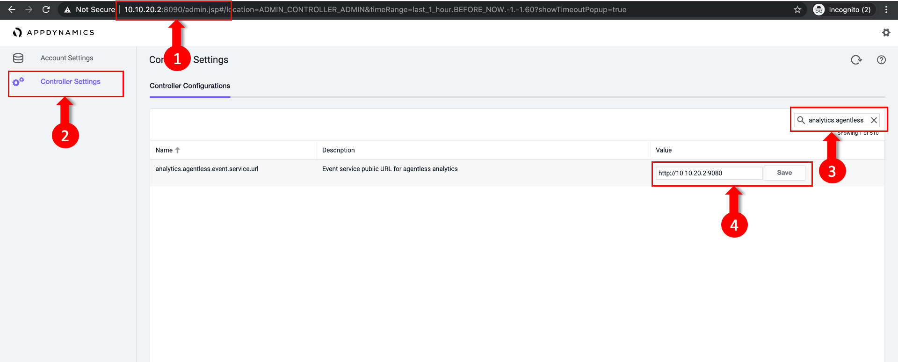

Analytics formerly required a separate agent that was bundled with Machine Agent. However, Analytics is now agentless and embedded in the APM Agent for both .NET Agent >= 20.10 and Java Agent >= 4.5.15 on Controllers >= 4.5.16

In this exercise you will access your AppDynamics Controller from your web browser and enable the Agentless Analytics from there.

## Login to your controller

Use the URL below to login to your controller from your web browser.

```bash
http://[controller-vm-ip-address]:8090
```


## Navigate to the Analytics Configuration

**1 .** Select the **Analytics** tab at the top left of the screen.

**2 .** Select the **Configuration** Left tab.

**3 .** Select the **Transaction Analytics - Configuration** tab.

**4 .** **Mark the Checkbox** next to the SuperCars Application

**5 .** Click the **Save** button


## Validate the Events Service URL

You want to ensure it is set correctly and accessible by the Agentless Analytics.

**1 .** Log in to the administration console at **http://\[controller-vm-ip-address\]:8090/controller/admin.jsp** and use the Password: **welcome1**

**2 .** Select the **Controller Settings** from the Left tab.

**3 .** Search for **analytics.agentless.event.service.url** property.

**4 .** Insert your **Events Service Endpoint**. Since we are deploying the Events service on the same Controller VM, we will use the Controller IP and the Events Service Port 9080, which will be **http://\[controller-vm-ip-address\]:9080**



## Apply any manual load on the application

You want to verify that Analytics is working for that application and showing transactions.

1.  Select the **Analytics tab** at the top left of the screen.
2.  Select the **Home** Left tab.
3.  Wait for couple of minutes, and Validate that there is Analytics Data


